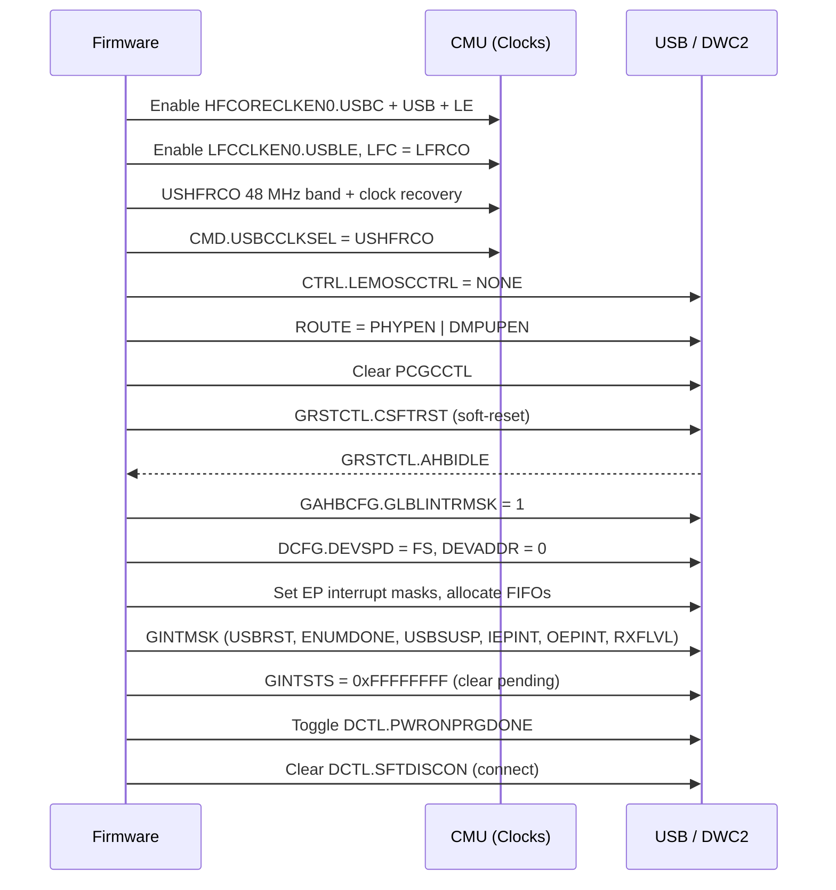
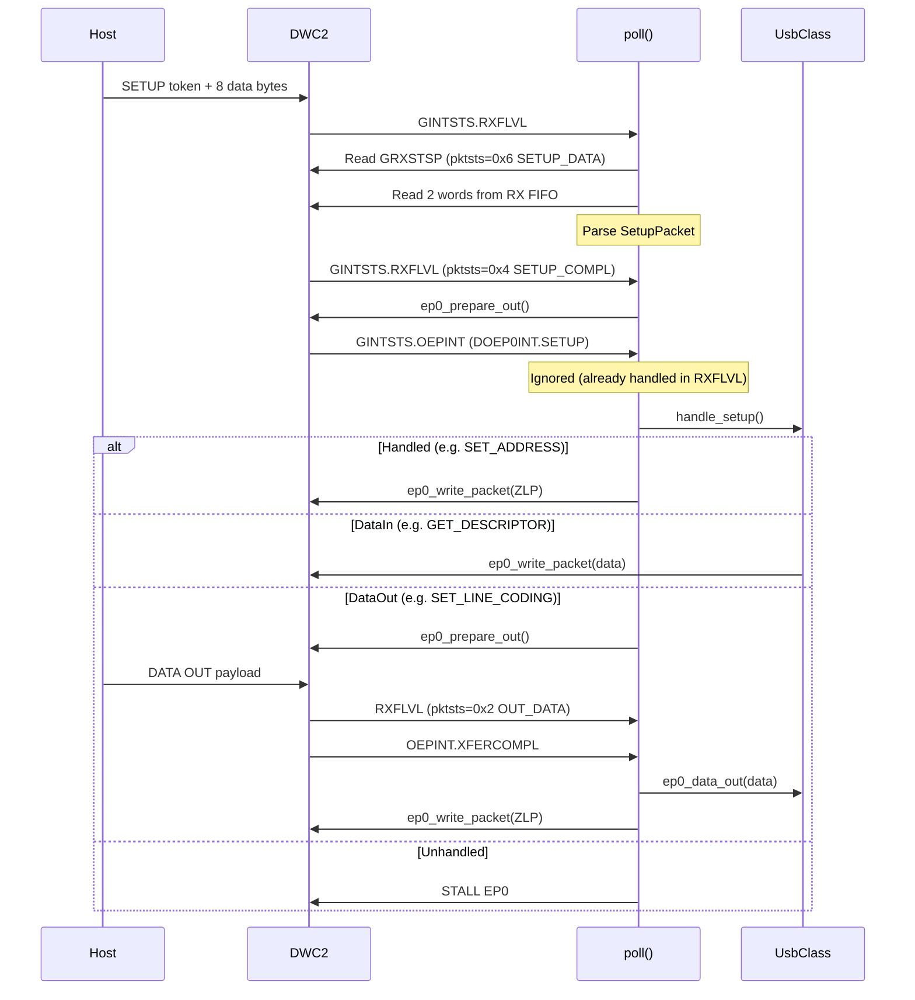
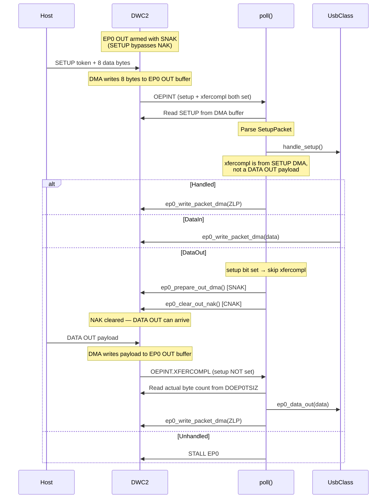
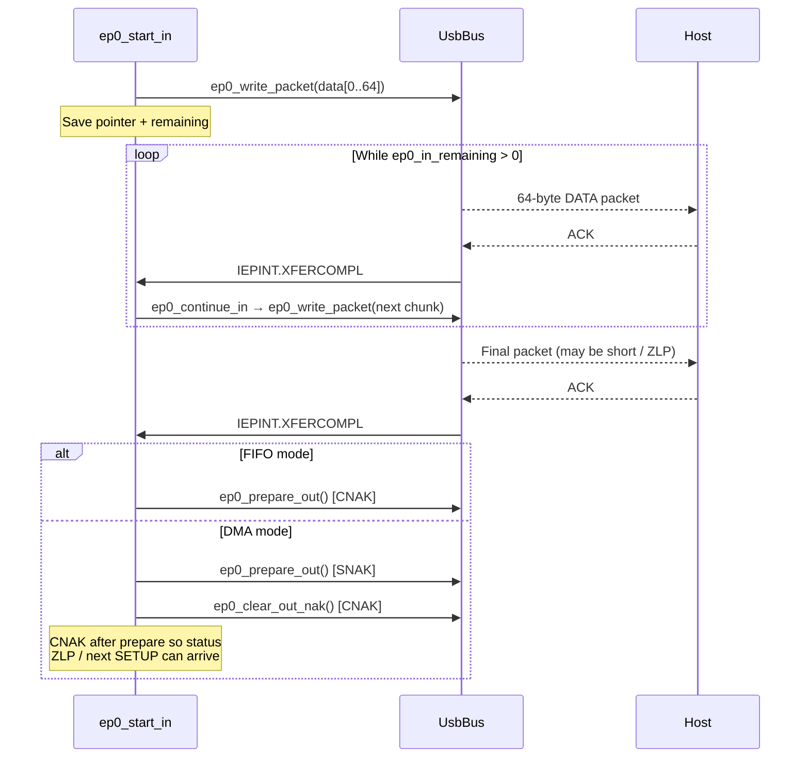
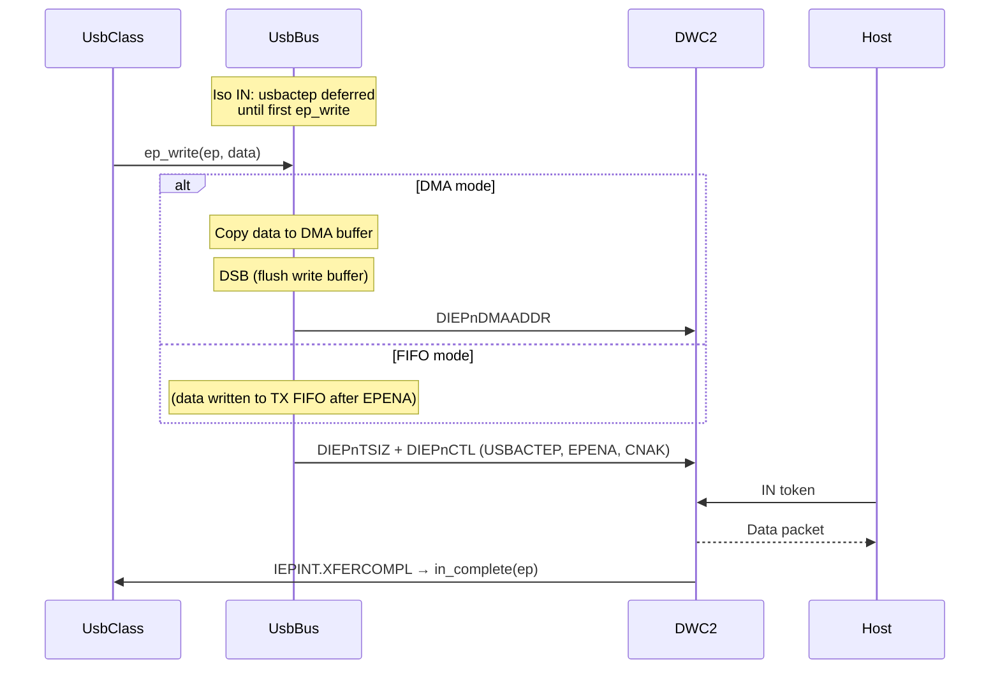
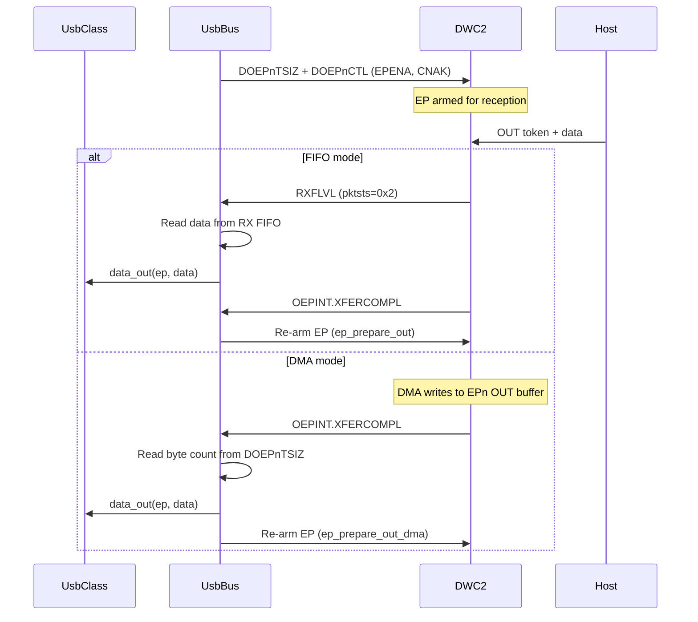
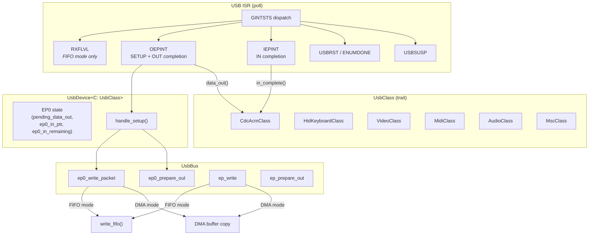

# efm32hg322_usb — DWC2 USB Device Driver for EFM32HG322

Bare-metal USB device driver for the EFM32 Happy Gecko (Cortex-M0+, EFM32HG322F64).
Uses the on-chip DWC2 OTG core in slave (FIFO) mode by default, with an optional
`dma` feature for the DWC2 internal DMA engine.

## DWC2 on the EFM32HG

| Property | Value |
|---|---|
| Core | Cortex-M0+ |
| DWC2 register base | `0x400C_4000` (USB peripheral base) |
| FIFO base | `USB_BASE + 0x3D000 + ep * 0x1000` |
| Device endpoints | EP0 + EP1 + EP2 (3 total) |
| FIFO RAM | 256 words (1 KB) shared |
| Max packet size (EP0) | 64 bytes |
| PHY | Integrated FS-only |
| USB clock | USHFRCO 48 MHz with SOF clock recovery |
| DMA support | Internal DMA via `feature = "dma"` |
| VBUS detection | `USB->CTRL.VREGOSEN` + `USB->STATUS.VREGOS` |
| OTG | No — device mode only |
| D+ pull-up | `USB->ROUTE.DMPUPEN` (explicit pull-up bit) |

### EFM32HG-specific init

No VBUS detection needed — the HG is typically bus-powered with VBUS always present.

## SETUP Packet Flow — FIFO (Slave) Mode

## SETUP Packet Flow — DMA Mode

EP0 OUT is always armed with **SNAK** so that only SETUP packets (which
bypass NAK on the DWC2) can arrive.  DATA OUT is gated by an explicit
`ep0_clear_out_nak()` call after the SETUP has been read and processed,
preventing a host DATA OUT from overwriting the SETUP data in the shared
DMA buffer before the ISR can parse it.

## Multi-Packet EP0 IN Transfer

`DIEP0TSIZ.xfersize` is only 7 bits wide (max 127), so descriptors
larger than 64 bytes must be sent one packet at a time in both modes.

## IN Transfer Flow (EPn)

Isochronous IN endpoints are activated with `usbactep` deferred: the bit
is **not** set in `activate_endpoints()` so the DWC2 NAKs host IN tokens
until the first `ep_write()` supplies real data.  This prevents the
controller from transmitting stale/zero data (which appears as a green
flash in YUY2 video).

## OUT Transfer Flow (EPn)

## Architecture

## Feature Flags

| Feature | Effect |
|---|---|
| *(default)* | FIFO (slave) mode — CPU reads/writes FIFOs directly |
| `dma` | DWC2 internal DMA mode — AHB DMA master handles transfers; uses ~1.3 KiB static RAM for DMA buffers |

In DMA mode, the public `UsbBus` API (`ep_write`, `ep_prepare_out`,
`ep0_write_packet`, `ep0_prepare_out`) dispatches to DMA internally,
so class drivers work transparently in both modes.
